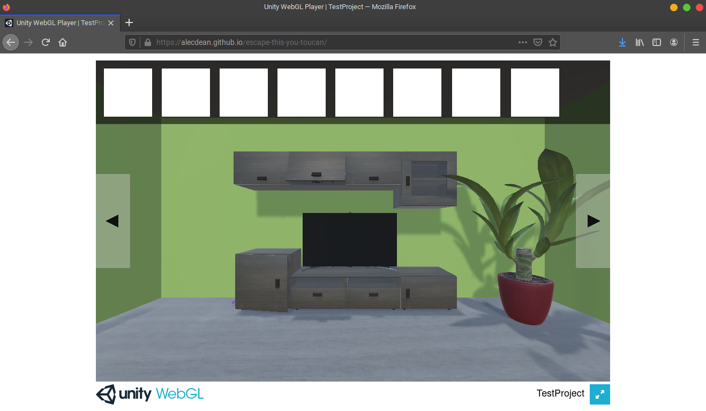

<!-- PROJECT LOGO -->
<br />
<p align="center">
  <a href="https://github.com/alecdean/RoomEscape">
    
  </a>

  <h3 align="center">Simple Escape Room Game</h3>

  <p align="center">
    This is a simple point and click, 3D, escape room game.
    <br />
    <br />
    <a href="https://alecdean.github.io/escape-this-you-toucan">Play Game</a>
  </p>
</p>


## Table of Contents
- [Table of Contents](#table-of-contents)
- [About The Project](#about-the-project)
  - [Built With](#built-with)
- [Gameplay](#gameplay)
- [Getting Started](#getting-started)
  - [Prerequisites](#prerequisites)
  - [Installation](#installation)
- [Acknowledgements](#acknowledgements)

<!-- ABOUT THE PROJECT -->
## About The Project



My roommate and I were obsessed with these online escape rooms in college, and so I watched some tutorials and tried making my own! I couldn't quite figure out how to make a puzzle within the game, but I was able to hide objects in certain places throughout the room. 

You can check out the tutorials I followed at [Board to Bits: Unity Point and Click Game Tutorial](https://www.youtube.com/watch?v=76z3LvGfuCk&list=PL5KbKbJ6Gf9-rgPHoW8QXn-ZfYQlieSAL)

And the game is currently up at [https://alecdean.github.io/escape-this-you-toucan]()

### Built With

* [Unity 3D](https://unity.com/)
* [C#](https://docs.microsoft.com/en-us/dotnet/csharp/)
* [WebGL](https://get.webgl.org/)


<!-- USAGE EXAMPLES -->
## Gameplay

To play the game, simply visit the [URL here](https://alecdean.github.io/escape-this-you-toucan). Here are a few tips to play in case you're stuck:
* You move around by **either** clicking on the arrows around the screen **or** by selecting a clickable location in the room. *There are no indicators to show which locations are clickable, so you must click around to find out.*
* If you see an object, you can click on it to add it to your inventory.
* To use an object in your inventory, select the specific item in inventory, then click on the object in the room you want to use it on. 
  * For example, if you have a key in your inventory, you can use it by selecting the key (it should become highlighted) and then clicking on a lock in the room. If it is the wrong key, it will not work.


<!-- GETTING STARTED -->
## Getting Started

If you'd simply like to play, just visit the URL above!

If you'd like to build it and run it yourself, follow the steps below.

### Prerequisites

In order to build an run the game you'll need the following software:

* Unity is the main requirement. I used [Unity 2019.1.1](https://unity3d.com/unity/whats-new/2019.1.1).
* The game runs on C#. You'll need Visual Studio installed to build and run, though you should have an option in the Unity installer to install the most recent version of VS.
* In order to build a WebGL version of the game, you'll also need the [WebGL plugin](https://docs.unity3d.com/Manual/webgl-building.html). The plugin should appear as an option in the Unity installer.


### Installation

1. Clone the repo
   ```sh
   git clone https://github.com/alecdean/RoomEscape.git
   ```
2. Open the project in Unity. You should be able to edit objects and move around.
3. To build the project for the web, see the instruction [here](https://docs.unity3d.com/Manual/webgl-building.html).


<!-- ACKNOWLEDGEMENTS -->
## Acknowledgements

* [Board to Bits Tutorials](https://www.youtube.com/watch?v=76z3LvGfuCk&list=PL5KbKbJ6Gf9-rgPHoW8QXn-ZfYQlieSAL)


<!-- MARKDOWN LINKS & IMAGES -->
<!-- https://www.markdownguide.org/basic-syntax/#reference-style-links -->
[contributors-shield]: https://img.shields.io/github/contributors/alecdean/repo.svg?style=for-the-badge
[contributors-url]: https://github.com/alecdean/repo/graphs/contributors
[forks-shield]: https://img.shields.io/github/forks/alecdean/repo.svg?style=for-the-badge
[forks-url]: https://github.com/alecdean/repo/network/members
[stars-shield]: https://img.shields.io/github/stars/alecdean/repo.svg?style=for-the-badge
[stars-url]: https://github.com/alecdean/repo/stargazers
[issues-shield]: https://img.shields.io/github/issues/alecdean/repo.svg?style=for-the-badge
[issues-url]: https://github.com/alecdean/repo/issues
[license-shield]: https://img.shields.io/github/license/alecdean/repo.svg?style=for-the-badge
[license-url]: https://github.com/alecdean/repo/blob/master/LICENSE.txt
[linkedin-shield]: https://img.shields.io/badge/-LinkedIn-black.svg?style=for-the-badge&logo=linkedin&colorB=555
[linkedin-url]: https://linkedin.com/in/alecdean
